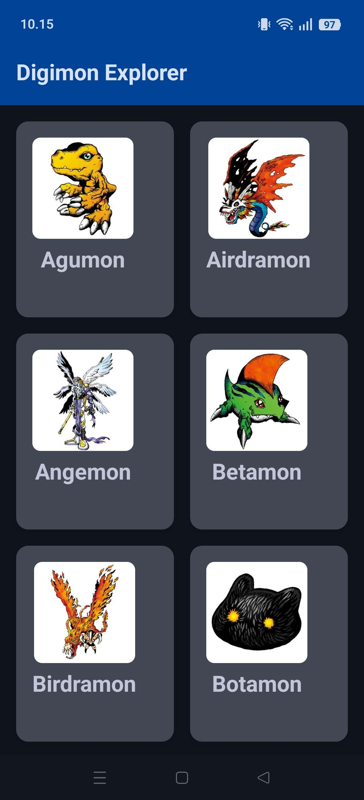
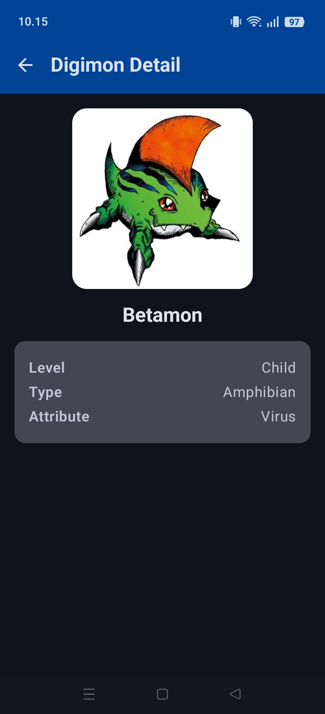

# Aplikasi Ekplorasi Digimon

Aplikasi ini merupakan tugas Responsi Praktikum Pemrograman Mobile. Aplikasi ini menampilkan daftar karakter Digimon beserta detailnya dengan mengambil data dari API Publik.

## Identitas Mahasiswa
* **Nama:** Nalendra Wicaksana
* **NIM:** H1D024073
* **Shift Lama:** E
* **Shift Baru:** D

---

## Deskripsi Singkat Aplikasi
**Aplikasi Ekplorasi Digimon** adalah aplikasi Android berbasis Kotlin modern yang berfungsi sebagai ensiklopedia karakter Digimon. Aplikasi ini menarik data secara *real-time* dari [Digi API](https://digi-api.com/). 
Terdapat dua layar utama:
1. **Home Screen:** Menampilkan daftar karakter Digimon dalam bentuk Grid (2 Kolom) lengkap beserta gambarnya.
2. **Detail Screen:** Menampilkan informasi spesifik dari Digimon yang dipilih, mencakup Gambar, Nama, Level, Type, dan Attribute.

Aplikasi ini dirancang dengan berfokus pada efisiensi, menerapkan manajemen status UI yang interaktif (Loading, Error, dan Success), serta memanfaatkan 100% Jetpack Compose (tanpa layout XML).

---

## Screenshot Aplikasi
| Home Screen | Detail Screen |
| :---: | :---: |
|  |  |

---

## Penjelasan Teknis & Arsitektur

Aplikasi ini dibangun menggunakan arsitektur modern standar industri yang direkomendasikan oleh Google:

### 1. Arsitektur MVVM (Model-View-ViewModel)
Pemutakhiran struktur kode dibagi agar logika UI, status (*State*), dan manajemen data tidak saling tumpang tindih:
* **Model (`data/model`):** Menggunakan fitur *Data Class* Kotlin untuk merepresentasikan respons JSON dari API (seperti `DigimonListResponse` dan `DigimonDetailResponse`).
* **Repository (`data/repository`):** Bertindak sebagai *Single Source of Truth*. Mengisolasi sumber data API sehingga ViewModel tidak langsung memanggil library Retrofit.
* **ViewModel (`ui/viewmodel`):** Bertugas mengelola UI State (`HomeUiState` & `DetailUiState`) menggunakan `StateFlow` dan *Coroutines* (`viewModelScope`).
* **View (`ui/screen`):** Merender tampilan UI secara deklaratif dengan memantau (`collectAsState()`) data dari ViewModel.

### 2. UI / UX (Jetpack Compose & Material Design 3)
* Seluruh antarmuka tidak menggunakan XML layout lama (`res/layout`).
* Memanfaatkan **Jetpack Compose** dengan kerangka **Material 3** (`Scaffold`, `TopAppBar`, `Card`).
* Tema dan **Custom Typography** diatur pada folder `ui/theme/`.
* Menggunakan `LazyVerticalGrid` untuk daftar di Home Screen sehingga efisien secara memori (*Lazy Loading*).

### 3. Networking & Image Loading
* **Retrofit & Gson:** Melakukan *HTTP Request* (metode GET) ke API eksternal dan langsung di-konversi menjadi objek Kotlin yang aman.
* **Coil Compose:** Digunakan untuk memuat gambar Digimon (`AsyncImage`) secara asinkron dari URL *(Asynchronous Image Loading)* agar aplikasi tidak lag saat memuat gambar beresolusi tinggi.

### 4. Jetpack Navigation
* Rute antar *Screen* (*Home* ke *Detail* dan kembali lagi) diatur menggunakan `navigation-compose` (`AppNavigation.kt`).
* Data *parameter* / *argument* (seperti `digimonId`) dipassing (*passed*) antar-screen secara mulus di dalam NavGraph.

### 5. Fitur Bahasa Kotlin Modern
* Memanfaatkan kontrol **Null Safety** (`?`, `?:`, `let`) bawaan Kotlin dengan maksimal agar aplikasi terhindar dari *Null Pointer Exception (NPE)* apabila data dari API sedang kosong.
* Menggunakan **Coroutines** (terutama `Dispatchers.IO`) untuk menjalankan tugas unduh jaringan di latar belakang tanpa menghalangi *Main Thread* (UI Thread).
* **Lambda Expressions** digunakan secara intensif pada aksi tombol (*onClick*), transformasi koleksi data (`joinToString`), dan navigasi.
